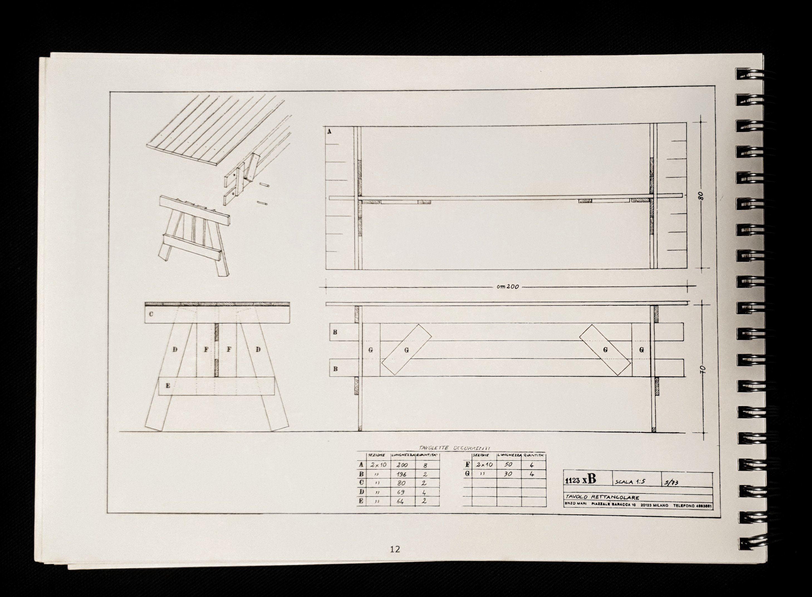
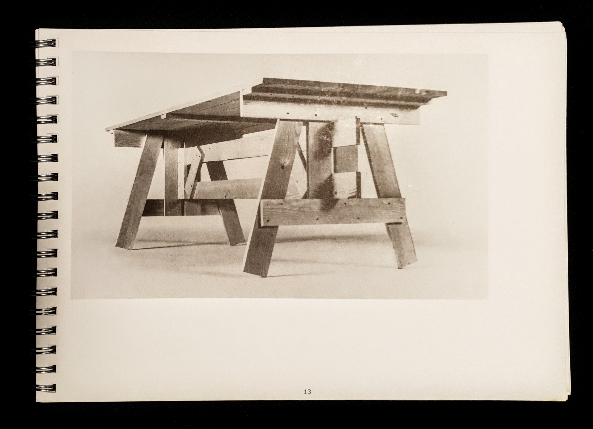

# Enzo Mari's _Tavolo Rettangolare_ in your own dimensions

The table in code: https://jo.github.io/enzo-mari/

    A project for making easy-to-assemble
    furniture using rough boards and nails.
    An elementary technizue to teach anyone
    to look at present production with a
    critical eye.

    (Anyone, apart from factories and
    traders, can use these designs to make
    them by themselves.
    The author hopes the idea will last
    into the future and asks those who
    build the furniture, and in particular,
    variations of it, to send photos to his
    studio at 10 piazzale Baracca, 10 -
    29123 Milan).

    © project Enzo Mari, 1974

from the book [autoprogettazione?](resources/Enzo-Mari-Autoprogettazione2.pdf)

## Tavolo Rettangolare

